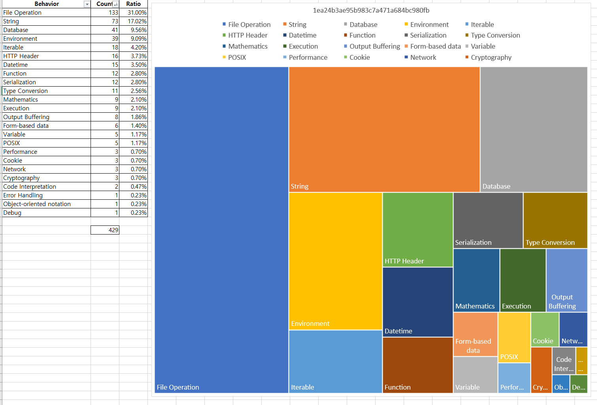

# php-behavior-analysis
Make a silhouette of the PHP file

## Files
 * Signature.txt - Functions list with labels
 * PHP-Behavior-Analysis.ipynb - Functions(API) extraction
 * example.png - Example of graph

